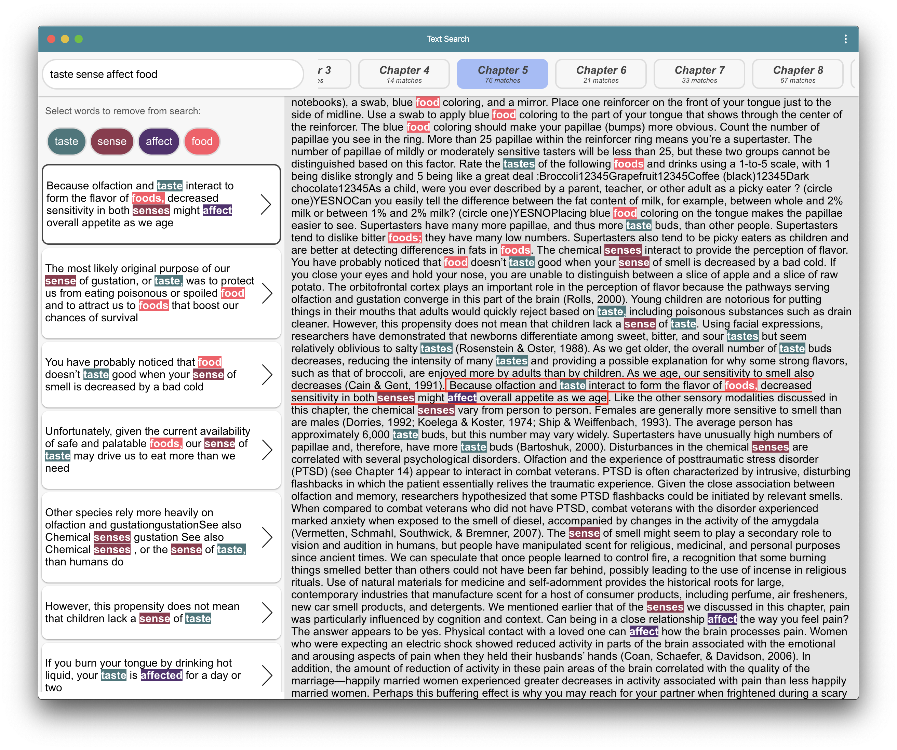
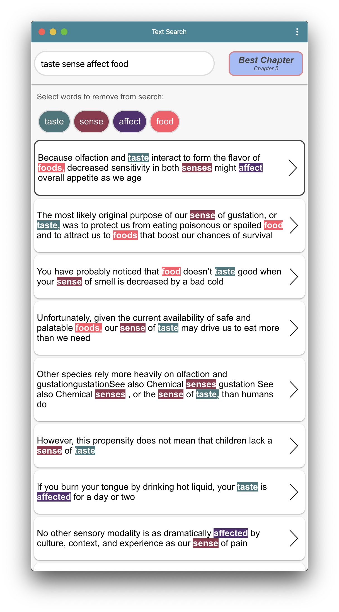

<p align="center">
   
</p>
<p align="center">
  <a href="https://khevamann.com/textsearch" target='_blank'>Live App</a>
</p>

# Text Search
I built this text search to allow for more advanced searching of text documents. Right now it only works with the Psychology text book included in `/assets` but I have plans to make it work for any text file or pdf.

## Features

- Search using a fuzzy search method that allows for "close to" matches
- Scores sentences based on number of matched words, the uniqueness of those matches and the length
- Tells you which chapter contains the most matches and will automatically navigate there if "Best Chapter" is chosen
- Supports mobile devices

## Planned Features

- Add support to upload any .txt file or pdf to include in searches


## Screenshots

Desktop                                   |  Mobile
:----------------------------------------:|:-------------------------:
  |  

## Development

This PWA is written using [React](https://reactjs.org/).

### Getting started

```sh
git clone https://github.com/khevamann/text-search.git
cd text-search

# Install dependencies
npm install

# To run a local development instance
npm run start

# To build the app (to /build folder)
npm run build
```
